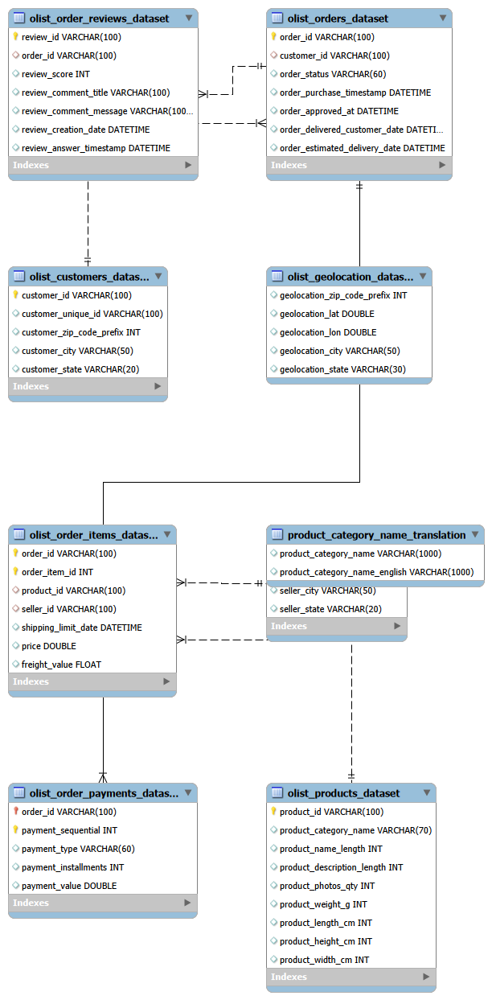

# Olist E-Commerce SQL Analysis

## Project Overview

This project analyzes the Brazilian Olist E-Commerce dataset using MySQL.

The project covers a complete SQL analysis workflow, including database creation, data import, data quality validation, exploratory data analysis, and business-focused analysis.

The goal is to use SQL to investigate customer behavior, product sales, seller performance, delivery performance, payment behavior, revenue trends, and customer satisfaction while working with a real-world relational dataset.

---

## Dataset

The project uses the Brazilian E-Commerce Public Dataset by Olist, containing approximately 100,000 orders from 2016 to 2018.

The dataset contains information about:

- Customers
- Orders
- Order items
- Products
- Sellers
- Payments
- Reviews
- Geolocation
- Product category translations

The relational structure of the dataset enables analysis across different areas of the e-commerce marketplace.

---

## Database Schema

The dataset was organized as a relational MySQL database connecting customers, orders, order items, products, sellers, payments, and reviews.

The Entity Relationship Diagram below shows the database structure and relationships used throughout the project.



---

## Tools Used

- MySQL
- MySQL Workbench
- SQL
- Git
- GitHub
- Visual Studio Code

---

## Project Structure

```text
olist-ecommerce-sql-analysis/
│
├── README.md
│
└── sql/
    ├── 01_database_setup/
    │   ├── 01_create_database.sql
    │   ├── 02_create_tables.sql
    │   └── 03_import_data.sql
    │
    ├── 02_data_quality/
    │   ├── 01_customers.sql
    │   ├── 02_geolocation.sql
    │   ├── 03_order_items.sql
    │   ├── 04_order_payments.sql
    │   ├── 05_order_reviews.sql
    │   ├── 06_orders.sql
    │   ├── 07_products.sql
    │   └── 08_sellers.sql
    │
    ├── 03_exploratory_analysis/
    │   ├── customer_geography.sql
    │   ├── product_category_sales.sql
    │   └── review_geography.sql
    │
    ├── 04_business_analysis/
    │   ├── category_revenue.sql
    │   ├── delivery_delay_by_state.sql
    │   ├── delivery_performance.sql
    │   ├── delivery_vs_satisfaction.sql
    │   ├── freight_cost_analysis.sql
    │   ├── monthly_revenue_growth.sql
    │   ├── order_size_vs_satisfaction.sql
    │   ├── payment_behavior.sql
    │   ├── payment_method_by_state.sql
    │   ├── price_segment_analysis.sql
    │   ├── seller_category_dependence.sql
    │   ├── seller_monthly_revenue_growth.sql
    │   ├── seller_performance.sql
    │   ├── seller_revenue_concentration.sql
    │   └── top_category_by_state.sql
    │
    └── docs/
        └── er_diagram.png
```

---

## Data Quality Analysis

Before performing the analysis, each dataset was examined for potential data quality issues.

The validation process included:

- Missing value analysis
- Primary key uniqueness checks
- Foreign key integrity checks
- Duplicate detection
- Numeric range validation
- Date range validation
- Chronological consistency checks
- Categorical value inspection
- Invalid or zero-value detection

Potential issues were investigated before making assumptions about whether values were incorrect. Data was only considered for modification when there was a justified reason to treat a value as invalid.

---

## Exploratory Data Analysis

Three exploratory analyses were performed to better understand the marketplace before answering more detailed business questions:

- Customer geographic distribution
- Product category sales
- Review scores across geographic regions

These analyses provided context for the more detailed business analysis performed later in the project.

---

## Business Analysis

Fifteen business-focused analyses were performed across revenue, sellers, delivery, payments, customers, and product categories.

### Revenue and Product Analysis

- Product category revenue contribution
- Product price segment analysis
- Monthly revenue growth
- Seller revenue concentration
- Seller monthly revenue growth

### Seller Analysis

- Seller performance and customer satisfaction
- Seller product category dependence

### Delivery and Logistics

- Overall delivery performance
- Delivery delays by customer state
- Delivery performance vs. customer satisfaction
- Freight cost analysis

### Customer, Order, and Payment Analysis

- Order size vs. customer satisfaction
- Payment behavior
- Most common payment method by customer state
- Top product category by customer state

---

## SQL Techniques Demonstrated

This project uses a range of SQL techniques, including:

- Multi-table `JOIN`s
- `GROUP BY` and aggregate functions
- Common Table Expressions (CTEs)
- Subqueries
- `CASE` expressions
- Date functions
- Conditional aggregation
- Window functions
- `ROW_NUMBER()`
- `RANK()` and `DENSE_RANK()`
- `LAG()`
- Running and cumulative calculations
- Revenue growth calculations
- Percentage calculations
- Data validation queries
- Multi-stage analytical queries

---

## Key Findings

The analysis explored several aspects of Olist's marketplace, including revenue distribution, seller performance, delivery behavior, payment patterns, product categories, and customer satisfaction.

Key findings will be summarized here using the actual results produced by the completed analyses.

---

## Data Limitations

Several limitations should be considered when interpreting the results:

- The dataset represents historical marketplace activity from 2016–2018 and should not be interpreted as current Olist performance.
- Some orders contain incomplete lifecycle information.
- Missing delivery dates may occur for orders that were not successfully delivered.
- Duplicate review identifiers were present in the original review data and affected the number of records successfully imported under the database's primary key constraint.
- The final portion of the dataset contains only a partial period of marketplace activity, which can affect time-based comparisons.

---

## Skills Demonstrated

Through this project, I practiced:

- Relational database design
- SQL data analysis
- Data quality validation
- Analytical problem solving
- Translating business questions into SQL
- Managing data at different levels of granularity
- Preventing aggregation and join duplication errors
- Window-function analysis
- Time-series revenue analysis
- Organizing a SQL project with Git and GitHub

---

## Future Improvements

Possible extensions of the project include:

- Connecting SQL results to Python for additional analysis
- Creating visualizations or an interactive dashboard
- Performing statistical analysis on marketplace behavior
- Preparing selected features for machine learning analysis